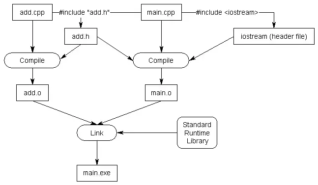

# Header Files

Header (`*.h`) files are intended to propagate forward declarations of related code (`*.cpp`) files.

## Standard Library Headers

When you `#include` a file, the content of the included file is inserted at the point of inclusion. This provides a useful way to pull in declarations from another file.

## Custom Header Files

See the included source code. [/src](./src)




## Definition in Header Causing ODR Violation

Do not put function and variable definitions in your header files (for now).

Defining either of these in a header file will likely result in a violation of the one-definition rule (ODR) if that header is then `#included` into more than one source (.cpp) file.

## Source Files Should Include Their Header

Including the header file in the related source file will allow the compiler to catch issues before linking.

## Do Not Include Source Files

Leads to many issues including:
- Naming collisions
- ODR violations
- Large recompilation of all files containing `#include`

## Angled Brackers vs. Double Quotes

Angled brackets for code we didn't write. This indicates to the preprocessor to check directories configured with your compiler, OS, or third-party libraries.

Double quotes for code we did write. This will look in your local context.

## Including Headers from Other Directories

```bash
g++ -o main -I/source/includes main.cpp
```

## Transitive Headers

When your code file `#includes` the first header file, you’ll also get any other header files that the first header file includes (and any header files those include, and so on). These additional header files are sometimes called transitive includes, as they’re included implicitly rather than explicitly.

Do not rely on transitive includes. Each file should explicitly `#include` all of the header files it needs to compile. Do not rely on headers included transitively from other headers.

## Ordering Headers

1. The paired header file
2. Other headers from your project
3. 3rd party library headers
4. Standard library headers

## Header Best Practices

* Always include header guards.
* Do not define variables and functions in header files (for now).
* Give a header file the same name as the source file it’s associated with (e.g. grades.h is paired with grades.cpp).
* Each header file should have a specific job, and be as independent as possible. For example, you might put all your declarations related to functionality A in A.h and all your declarations related to functionality B in B.h. That way if you only care about A later, you can just include A.h and not get any of the stuff related to B.
* Be mindful of which headers you need to explicitly include for the functionality that you are using in your code files, to avoid inadvertent transitive includes.
* A header file should #include any other headers containing functionality it needs. Such a header should compile successfully when #included into a .cpp file by itself.
* Only #include what you need (don’t include everything just because you can).
* Do not #include .cpp files.
* Prefer putting documentation on what something does or how to use it in the header. It’s more likely to be seen there. Documentation describing how something works should remain in the source files.
