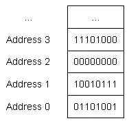

# Fundamental Data Types

Memory addresses label locations of bytes (groups of 8 bits) in RAM.

Data types are assignment of memory to a certain interpretation.

| Data Type              | Category             | Meaning                                    |
|------------------------|----------------------|--------------------------------------------|
| float                  | floating point       | number with fractional part                |
| double                 |                      |                                            |
| long double            |                      |                                            |
| boolean                | integral (boolean)   | true or false                              |
| char                   | integral (character) | single character of text                   |
| wchar_t                |                      |                                            |
| char8_t (C++20)        |                      |                                            |
| char16_t (C++11)       |                      |                                            |
| char32_t (C++11)       |                      |                                            |
| short int              | integral (integer)   | positive and negative whole numbers, and 0 |
| int                    |                      |                                            |
| long int               |                      |                                            |
| long long int (C++11)  |                      |                                            |
| void                   | no type              |                                            |
| std::nullptr_t (C++11) | null pointer         | a null pointer                             |

